# 🚗 Auto Lab Solutions - Backend System

<div align="center">

[](https://aws.amazon.com)
[](https://python.org)
[](https://aws.amazon.com/dynamodb/)
[](https://aws.amazon.com/lambda/)
[](https://aws.amazon.com/cloudformation/)

*A comprehensive automotive service management system built on AWS serverless architecture*

</div>

## 📋 Table of Contents

- [🏗️ Architecture Overview](#%EF%B8%8F-architecture-overview)
- [✨ Core Features](#-core-features)
- [🔐 Authentication & Authorization](#-authentication--authorization)
- [📊 Database Schema](#-database-schema)
- [🚀 API Endpoints](#-api-endpoints)
- [📧 Email System](#-email-system)
- [🔄 Business Workflows](#-business-workflows)
- [🏗️ Infrastructure Components](#%EF%B8%8F-infrastructure-components)
- [🔄 CI/CD Pipeline](#-cicd-pipeline)
- [📱 Real-time Communication](#-real-time-communication)
- [💰 Payment Processing](#-payment-processing)
- [📊 Analytics & Reporting](#-analytics--reporting)
- [🛡️ Security Features](#%EF%B8%8F-security-features)
- [🚀 Deployment](#-deployment)
- [🧪 Testing & Validation](#-testing--validation)

---

## 🏗️ Architecture Overview

Auto Lab Solutions is a serverless automotive service management system built entirely on AWS infrastructure. The system follows microservices architecture using AWS Lambda functions, DynamoDB for data persistence, and various AWS services for comprehensive functionality.

### 🏢 System Architecture

```
┌─────────────────┐    ┌──────────────────┐    ┌─────────────────┐
│   Frontend      │────│   API Gateway    │────│   Lambda        │
│   (React)       │    │   (REST API)     │    │   Functions     │
└─────────────────┘    └──────────────────┘    └─────────────────┘
                                │                        │
┌─────────────────┐    ┌──────────────────┐    ┌─────────────────┐
│   Auth0         │────│   WebSocket      │────│   DynamoDB      │
│   (Identity)    │    │   (Real-time)    │    │   (Database)    │
└─────────────────┘    └──────────────────┘    └─────────────────┘
                                │                        │
┌─────────────────┐    ┌──────────────────┐    ┌─────────────────┐
│   Stripe        │────│   SQS Queues     │────│   S3 + CDN      │
│   (Payments)    │    │   (Async Tasks)  │    │   (File Storage)│
└─────────────────┘    └──────────────────┘    └─────────────────┘
                                │
                       ┌──────────────────┐
                       │   SES            │
                       │   (Email)        │
                       └──────────────────┘
```

### 🎯 Key Architectural Principles

- **📈 Serverless-First**: 100% serverless using AWS Lambda for zero server management
- **🔄 Event-Driven**: Asynchronous processing using SQS queues for scalability
- **🏗️ Infrastructure as Code**: Complete infrastructure defined in CloudFormation
- **🔒 Security by Design**: JWT-based authentication with role-based access control
- **📊 Real-time Updates**: WebSocket connections for live staff communication
- **💾 Data Consistency**: ACID transactions with DynamoDB's native capabilities

---

## ✨ Core Features

### 🗓️ **Appointment Management**
- **📅 Schedule Management**: Advanced scheduling system with conflict detection
- **⏰ Time Slot Management**: Dynamic availability tracking and booking prevention
- **📋 Service Tracking**: Complete appointment lifecycle from creation to completion
- **🔄 Status Transitions**: Automated status updates (Scheduled → In Progress → Completed)
- **📱 Real-time Updates**: Staff notifications for appointment changes

### 🛠️ **Service & Order Management** 
- **📦 Service Catalog**: Dynamic pricing for automotive services
- **🔧 Parts Management**: Inventory tracking for automotive parts and components
- **💼 Order Processing**: End-to-end order management with status tracking
- **📊 Service History**: Complete customer service history and analytics

### 💳 **Payment Processing**
- **💰 Multi-Payment Support**: Cash, bank transfer, and Stripe credit card payments
- **🧾 Invoice Generation**: Automated PDF invoice creation and delivery
- **📧 Payment Confirmation**: Email notifications for successful payments
- **🔄 Payment Status Tracking**: Real-time payment status updates

### 👥 **Customer Management**
- **👤 User Profiles**: Complete customer information management
- **🚗 Vehicle Records**: Multi-vehicle support per customer
- **📞 Communication History**: Complete message and inquiry tracking
- **📊 Service Analytics**: Customer service patterns and history

### 💬 **Communication System**
- **📱 Real-time Messaging**: WebSocket-based staff-customer communication
- **📧 Email Automation**: Comprehensive email notification system
- **🔔 Multi-channel Notifications**: Email, WebSocket, and optional Firebase push notifications
- **📝 Inquiry Management**: Structured customer inquiry handling

### 📊 **Analytics & Reporting**
- **📈 Revenue Analytics**: Comprehensive revenue tracking and analysis
- **👥 Customer Analytics**: Customer behavior and service patterns
- **🔧 Service Analytics**: Popular services and performance metrics
- **📅 Operational Analytics**: Staff productivity and system usage

---

## 🔐 Authentication & Authorization

### 🔑 Auth0 Integration
The system uses **Auth0** for authentication with custom JWT token processing:

```javascript
// Auth0 Post-Login Action
exports.onExecutePostLogin = async (event, api) => {
  const userEmail = event.user.email;
  // Validates email verification
  // Calls backend API to get staff roles
  // Sets custom claims in JWT tokens
  api.idToken.setCustomClaim('is_staff', true);
  api.idToken.setCustomClaim('staff_roles', roles);
}
```

### 👥 Role-Based Access Control
- **🔐 ADMIN**: Full system access, user management, analytics
- **👨‍💼 MANAGER**: Business operations, staff oversight, reporting
- **🔧 MECHANIC**: Service operations, appointment management
- **📞 CUSTOMER_SUPPORT**: Customer communication, inquiry management
- **📋 STAFF**: Basic staff operations and customer interaction

### 🛡️ API Security
- **🔐 JWT Token Validation**: All protected endpoints require valid JWT
- **🔑 Custom Authorizers**: Lambda authorizers for fine-grained access control
- **🔒 Role Validation**: Function-level role checking for administrative operations
- **🚫 Request Filtering**: Input validation and sanitization on all endpoints

---

## 📊 Database Schema

The system uses **15 DynamoDB tables** for comprehensive data management:

### 🏢 Core Business Tables

| Table | Purpose | Key Structure |
|-------|---------|---------------|
| **👥 Staff** | Staff member management | `userEmail (PK)` |
| **👤 Users** | Customer information | `userId (PK)` |
| **🔗 Connections** | WebSocket connections | `connectionId (PK)` |
| **💬 Messages** | Chat communication | `messageId (PK)` |
| **⏰ UnavailableSlots** | Scheduling management | `date (PK)` |
| **📅 Appointments** | Service appointments | `appointmentId (PK)` |
| **🔧 ServicePrices** | Service pricing | `serviceId (PK)` |
| **📦 Orders** | Product orders | `orderId (PK)` |
| **🔩 ItemPrices** | Parts pricing | `itemId (PK)` |
| **❓ Inquiries** | Customer inquiries | `inquiryId (PK)` |
| **💳 Payments** | Payment records | `paymentId (PK)` |
| **🧾 Invoices** | Invoice tracking | `invoiceId (PK)` |

### 📧 Email Management Tables

| Table | Purpose | Key Structure |
|-------|---------|---------------|
| **🚫 EmailSuppression** | Bounce/complaint tracking | `email (PK)` |
| **📊 EmailAnalytics** | Email performance metrics | `analyticsId (PK)` |
| **📝 EmailMetadata** | Email metadata storage | `messageId (PK)` |

### 🔄 Data Relationships

```
Users (1:N) ────────► Appointments ────────► Payments ────────► Invoices
  │                      │                      
  │                      │                      
  └─── (1:N) Orders ─────┘                      
              │                                 
              │                                 
              └─── (N:1) ItemPrices            
                                               
ServicePrices (N:1) ─────► Appointments       
                                               
Staff (1:N) ─────────► Messages ────────► Users

Inquiries (N:1) ─────────► Users
```

---

## 🚀 API Endpoints

### 👤 **User Management**
```
GET    /users              # Get all users (staff only)
GET    /check-user         # Validate user existence
POST   /update-user-info   # Update user information
```

### 📅 **Appointment Management**
```
GET    /appointments       # Get appointments (filtered by role)
POST   /appointments       # Create new appointment
PATCH  /appointments/{id}  # Update appointment
GET    /unavailable-slots  # Get blocked time slots
POST   /unavailable-slots  # Update slot availability
```

### 📦 **Order Management**
```
GET    /orders            # Get orders (filtered by role)
POST   /orders            # Create new order
PATCH  /orders/{id}       # Update order
GET    /prices            # Get service/item pricing
```

### 💳 **Payment Processing**
```
POST   /create-payment-intent    # Stripe payment initialization
POST   /confirm-stripe-payment   # Stripe payment confirmation
POST   /confirm-cash-payment     # Manual payment confirmation
POST   /webhook-stripe-payment   # Stripe webhook handler
```

### 🧾 **Invoice Management**
```
GET    /invoices          # Get invoice list
POST   /invoices          # Manual invoice generation
PATCH  /invoices          # Cancel/reactivate invoice
```

### 💬 **Communication**
```
GET    /messages          # Get message history
POST   /send-message      # Send message
GET    /connections       # Get active connections (staff)
GET    /last-messages     # Get recent conversations
```

### 📧 **Email Management**
```
POST   /send-email        # Send custom email
GET    /emails            # Get email history
PATCH  /emails/{id}       # Update email status
```

### ❓ **Inquiry Management**
```
GET    /inquiries         # Get customer inquiries
POST   /inquiries         # Create new inquiry
```

### 📊 **Analytics & Reporting**
```
GET    /analytics         # Comprehensive business analytics
GET    /get-staff-roles   # Get staff role information (Auth0 integration)
POST   /users/staff       # Update staff roles (admin only)
```

### 🔧 **System Operations**
```
GET    /upload-url        # Get S3 presigned URLs
POST   /backup-restore    # System backup/restore
POST   /notify            # Send notifications
```

---

## 📧 Email System

The system features a comprehensive email notification system with multiple automation triggers:

### 📬 Email Types & Templates

#### 🗓️ **Appointment Emails**
- **📅 Appointment Created**: Welcome email with appointment details
- **🔄 Appointment Updated**: Status change notifications
- **✅ Appointment Completed**: Service completion confirmation

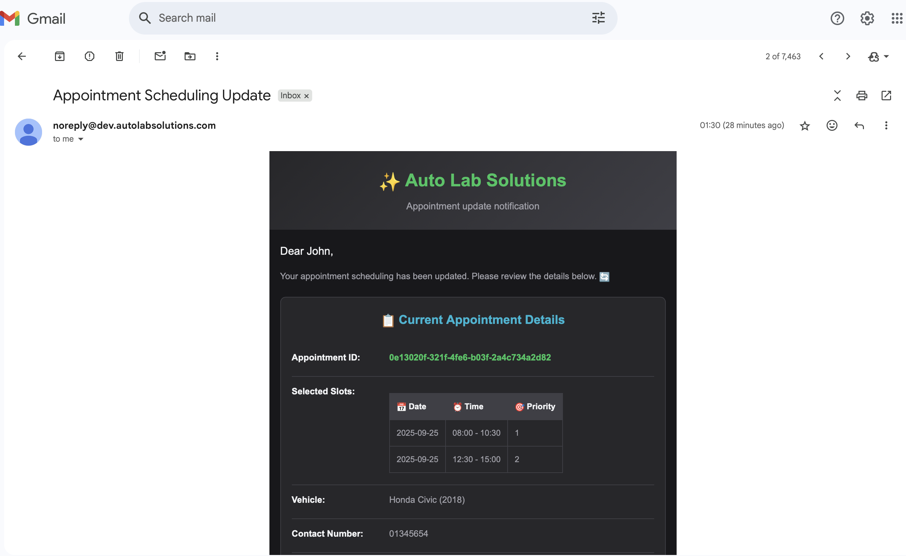
*Appointment scheduled confirmation email*

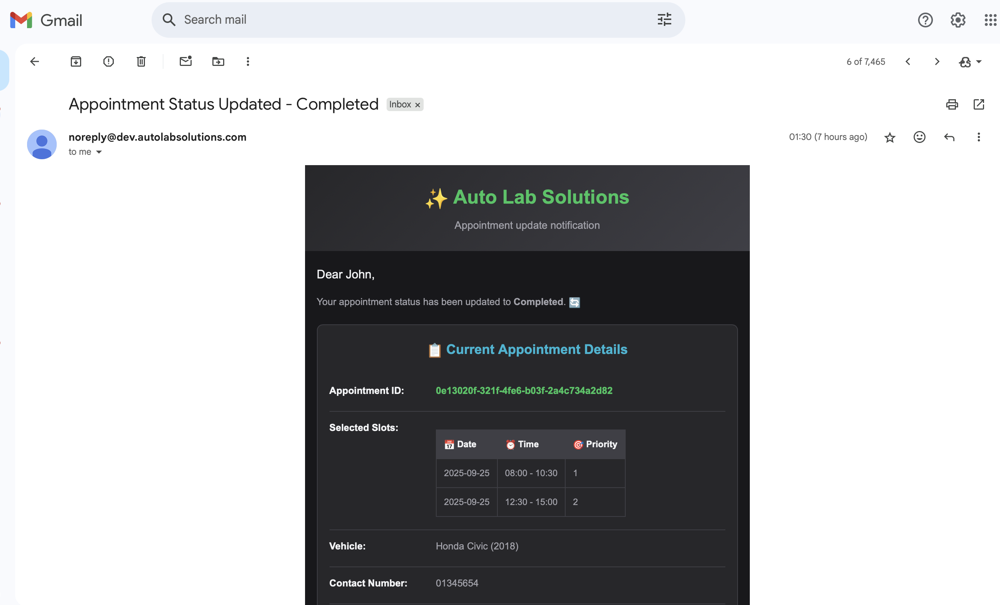
*Appointment completion notification email*

#### 💰 **Payment & Invoice Emails**
- **💳 Payment Confirmed**: Payment success with invoice attachment
- **📄 Invoice Generated**: Automated invoice delivery
- **🚫 Payment Cancelled**: Payment failure notifications

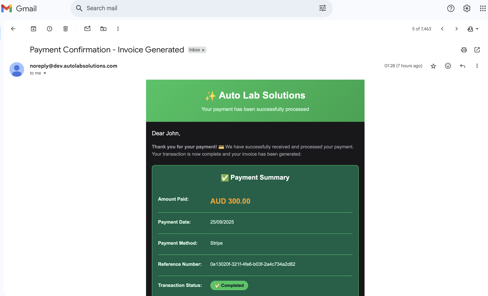
*Payment confirmation with invoice attachment*

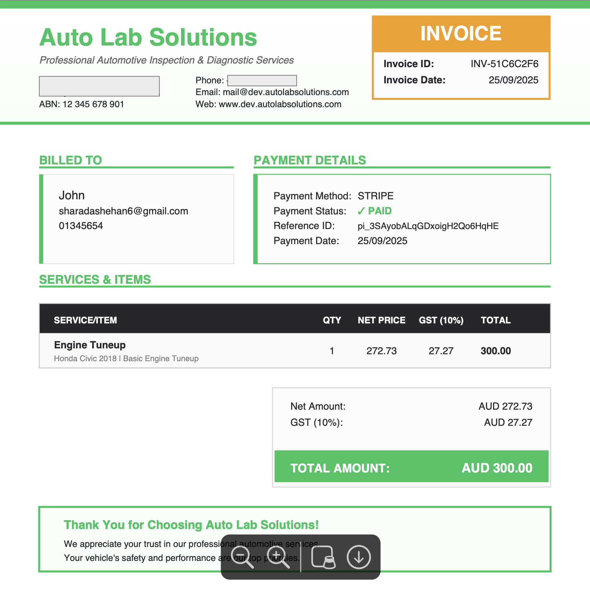
*Generated PDF invoice sample*

#### 📋 **Service Emails**
- **📊 Inspection Report Ready**: Report completion notifications
- **👨‍💼 Admin to Customer**: Custom staff communications

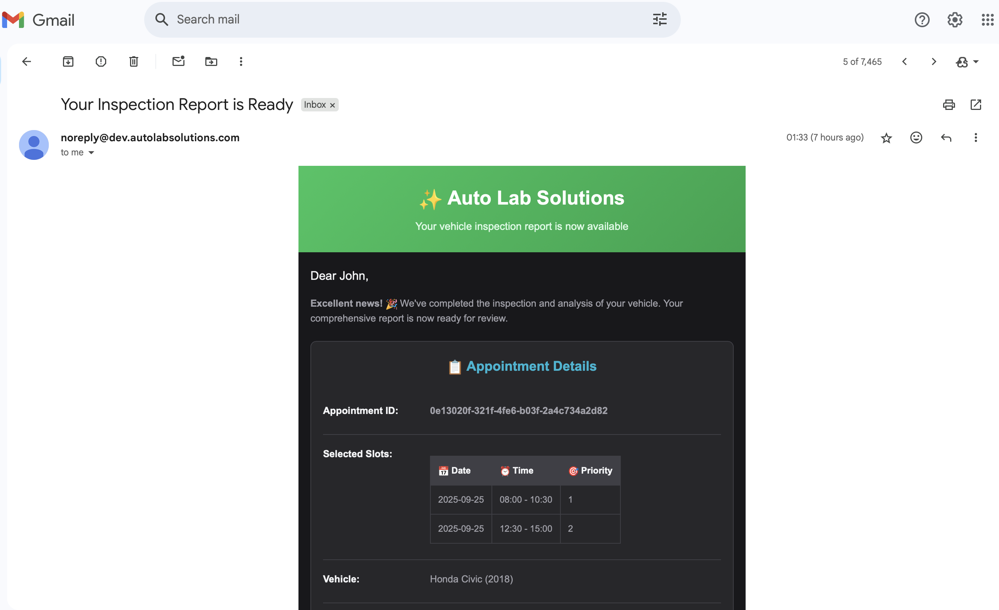
*Service report ready notification*

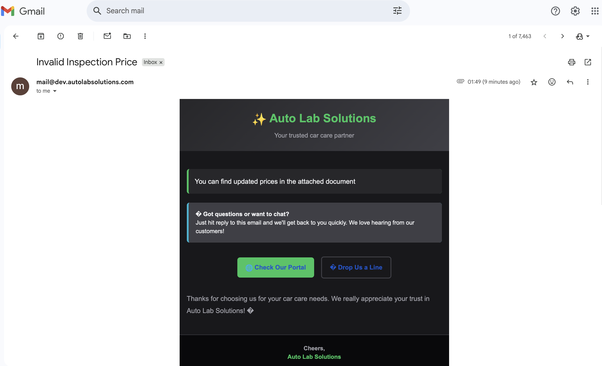
*Custom admin-to-customer communication*

### 🔧 Email Infrastructure

#### 📨 **AWS SES Integration**
```python
# Email sending with suppression checking
def send_email(to_email, subject, html_body, text_body=None, email_type=None):
    # Check bounce/complaint suppression
    if is_email_suppressed(to_email):
        return False
    
    # Send via SES
    response = ses_client.send_email(
        Source=NO_REPLY_EMAIL,
        Destination={'ToAddresses': [to_email]},
        Message={
            'Subject': {'Data': subject},
            'Body': {'Html': {'Data': html_body}}
        }
    )
```

#### 🔄 **Asynchronous Processing**
- **📬 SQS Queue**: Email notifications queued for async processing
- **🚫 Bounce Handling**: Automatic suppression of bounced emails
- **📊 Analytics Tracking**: Email open rates and delivery statistics
- **🔄 Retry Logic**: Failed email retry with exponential backoff

#### 🎨 **Email Templates**
- **🎨 HTML Templates**: Rich HTML email designs
- **📱 Mobile Responsive**: Optimized for all devices
- **🏷️ Dynamic Content**: Personalized with customer/appointment data
- **📎 Attachment Support**: PDF invoices and reports

---

## 🔄 Business Workflows

### 📅 **Appointment Booking Workflow**

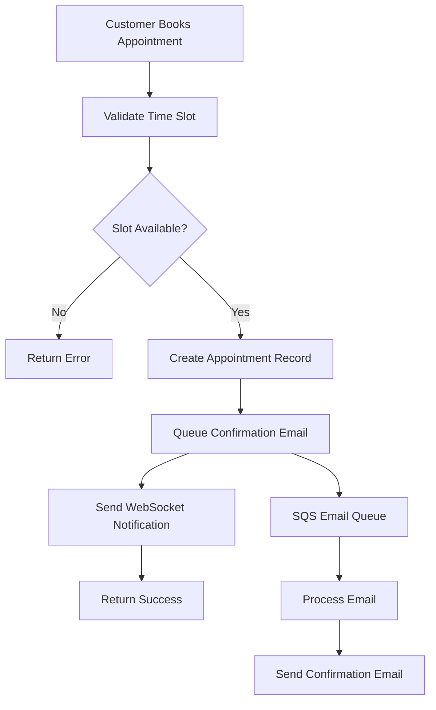

### 💳 **Payment Processing Workflow**

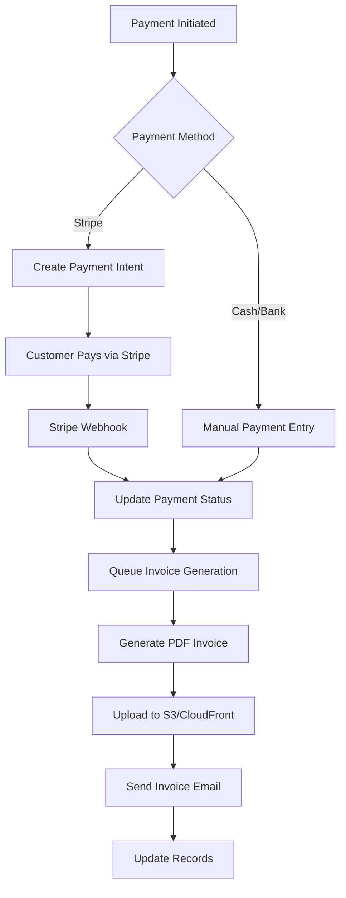

### 🔧 **Service Completion Workflow**

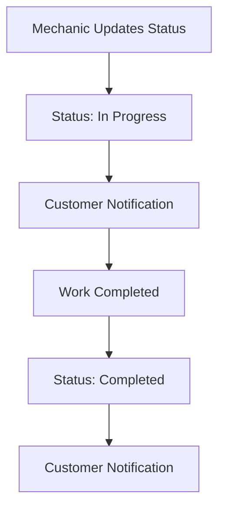

### 💬 **Real-time Communication Workflow**

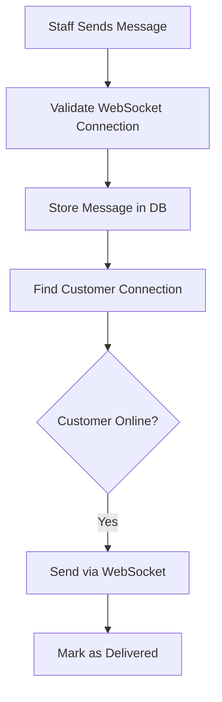

---

## 🏗️ Infrastructure Components

### ☁️ **AWS Services Used**

#### 🖥️ **Compute & API**
- **⚡ AWS Lambda**: 40+ serverless functions for business logic
- **🌐 API Gateway**: RESTful API with custom domain support
- **🔌 WebSocket API**: Real-time bidirectional communication
- **🔐 Lambda Authorizers**: JWT-based API security

#### 💾 **Data & Storage**
- **🗄️ DynamoDB**: 15 NoSQL tables with auto-scaling
- **🗃️ S3 Buckets**: File storage for reports and invoices
- **📡 CloudFront CDN**: Global content delivery network
- **🗂️ S3 Versioning**: File version control and backup

#### 📬 **Messaging & Notifications**
- **📮 SQS Queues**: Async task processing (Email, Invoice, Firebase)
- **📧 Amazon SES**: Transactional email delivery
- **🔔 Firebase Cloud Messaging**: Push notifications (optional)
- **📊 CloudWatch Logs**: Centralized logging and monitoring

#### 🔒 **Security & Networking**
- **🛡️ IAM Roles**: Least-privilege access control
- **🌐 Route53**: DNS management and health checks
- **🔒 ACM Certificates**: SSL/TLS encryption
- **🔐 Secrets Manager**: Secure credential storage

### 🏗️ **Infrastructure as Code**

The entire infrastructure is defined in **CloudFormation templates**:

```yaml
# Main Stack Architecture
Resources:
  # API Gateway with custom domains
  RestApi:
    Type: AWS::ApiGateway::RestApi
  
  # Lambda functions with proper IAM roles
  LambdaStack:
    Type: AWS::CloudFormation::Stack
    Properties:
      TemplateURL: lambda-functions.yaml
  
  # DynamoDB tables with backup enabled
  DatabaseStack:
    Type: AWS::CloudFormation::Stack
    Properties:
      TemplateURL: dynamodb-tables.yaml
  
  # S3 and CloudFront distribution
  StorageStack:
    Type: AWS::CloudFormation::Stack
    Properties:
      TemplateURL: s3-cloudfront.yaml
```

#### 📦 **Template Organization**
- **🏗️ main-stack.yaml**: Root infrastructure orchestration
- **⚡ lambda-functions.yaml**: All Lambda function definitions
- **🌐 api-gateway.yaml**: API Gateway and routing configuration
- **🗄️ dynamodb-tables.yaml**: Database table definitions
- **🗃️ s3-cloudfront.yaml**: Storage and CDN configuration
- **📬 notification-queue.yaml**: SQS queue configurations
- **📧 ses-email-storage.yaml**: Email infrastructure
- **🔙 backup-system.yaml**: Automated backup system

---

## 🔄 CI/CD Pipeline

### 🚀 **GitHub Actions Workflows**

#### 🔄 **Development Deployment**
```yaml
# .github/workflows/deploy-dev.yml
name: Deploy Development
on:
  push:
    branches: [dev]

jobs:
  deploy:
    runs-on: ubuntu-latest
    environment: development
    steps:
      - name: Deploy Infrastructure
        run: ./deploy.sh development
      - name: Update Lambda Functions
        run: ./update-lambdas.sh --env dev --all
      - name: Validate Deployment
        run: ./validate-deployment.sh development
```

#### 🏭 **Production Deployment**
```yaml
# .github/workflows/deploy-prod.yml
name: Deploy Production
on:
  push:
    branches: [main]

jobs:
  deploy:
    runs-on: ubuntu-latest
    environment: production
    steps:
      - name: Validate Templates
        run: aws cloudformation validate-template
      - name: Deploy with Approval
        run: ./deploy.sh production
```

#### ⚡ **Lambda Updates**
```yaml
# .github/workflows/update-lambdas.yml
name: Update Lambda Functions
on:
  workflow_dispatch:
    inputs:
      environment:
        required: true
        type: choice
        options: [development, production]
      functions:
        required: false
        description: 'Comma-separated function names'

jobs:
  update:
    steps:
      - name: Update Functions
        run: ./update-lambdas.sh --env ${{ inputs.environment }}
```

### 🔧 **Environment Management**

#### 🏗️ **Environment Configuration**
```bash
# config/environments.sh
get_env_config() {
    case $env in
        development)
            export ENVIRONMENT="development"
            export FRONTEND_DOMAIN="dev.autolabsolutions.com"
            export API_DOMAIN="api-dev.autolabsolutions.com"
            ;;
        production)
            export ENVIRONMENT="production"
            export FRONTEND_DOMAIN="autolabsolutions.com"
            export API_DOMAIN="api.autolabsolutions.com"
            ;;
    esac
}
```

#### 🧪 **Deployment Scripts**
- **🚀 deploy.sh**: Complete infrastructure deployment
- **⚡ update-lambdas.sh**: Lambda function updates
- **✅ validate-deployment.sh**: Post-deployment validation
- **🧪 validate-cicd.sh**: CI/CD configuration validation

---

## 📱 Real-time Communication

### 🔌 **WebSocket Architecture**

The system implements comprehensive real-time communication using **AWS WebSocket API**:

#### 🔗 **Connection Management**
```python
# WebSocket connection handlers
def handle_connect(event, context):
    connection_id = event['requestContext']['connectionId']
    # Store connection in DynamoDB
    db.create_connection(connection_id)

def handle_disconnect(event, context):
    connection_id = event['requestContext']['connectionId']
    # Clean up connection and user associations
    db.delete_connection(connection_id)
```

#### 👤 **User Initialization**
```python
# User/Staff initialization on WebSocket
def handle_init(event, context):
    connection_id = event['requestContext']['connectionId']
    body = json.loads(event.get('body', '{}'))
    
    if body.get('userType') == 'staff':
        # Associate staff member with connection
        staff_email = body.get('staffEmail')
        db.associate_staff_connection(connection_id, staff_email)
    else:
        # Associate customer with connection
        user_id = body.get('userId')
        db.associate_user_connection(connection_id, user_id)
```

#### 💬 **Message Broadcasting**
```python
# Real-time message delivery
def send_message_to_connection(connection_id, message):
    try:
        apigateway_client.post_to_connection(
            ConnectionId=connection_id,
            Data=json.dumps(message)
        )
    except ClientError:
        # Connection is stale, remove from database
        db.delete_connection(connection_id)
```

### 🔄 **Message Flow Architecture**

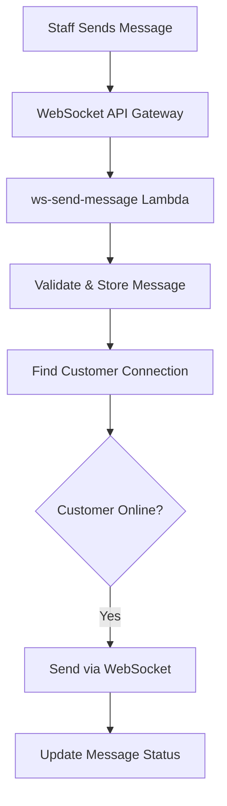

### 📊 **Connection Monitoring**
- **💓 Ping/Pong**: Keep-alive connection monitoring
- **🧹 Cleanup**: Automatic stale connection removal
- **📊 Analytics**: Connection duration and usage statistics
- **🔔 Notifications**: Real-time status updates for staff

---

## 💰 Payment Processing

### 💳 **Stripe Integration**

The system supports comprehensive payment processing through **Stripe**:

#### 🔄 **Payment Intent Flow**
```python
# Create payment intent
def create_payment_intent(amount, customer_email, metadata):
    intent = stripe.PaymentIntent.create(
        amount=int(amount * 100),  # Convert to cents
        currency='aud',
        customer_email=customer_email,
        metadata=metadata,
        automatic_payment_methods={'enabled': True}
    )
    return intent
```

#### 🔗 **Webhook Processing**
```python
# Stripe webhook handler
def handle_payment_succeeded(payment_intent):
    # Update payment record
    db.update_payment_status(payment_intent['id'], 'paid')
    
    # Update appointment/order
    reference_number = payment_intent['metadata']['reference_number']
    db.update_record_payment_status(reference_number, 'paid')
    
    # Queue invoice generation
    invoice_manager.queue_invoice_generation(record, record_type, payment_intent['id'])
```

### 💰 **Multi-Payment Support**

#### 💵 **Payment Methods**
- **💳 Credit/Debit Cards**: Stripe secure payment processing
- **💵 Cash Payments**: Manual cash payment confirmation
- **🏦 Bank Transfers**: Bank transfer payment tracking

#### 🧾 **Invoice Generation**
```python
# Automated invoice generation
def generate_invoice_pdf(record_data, record_type, payment_intent_id):
    # Create PDF using ReportLab
    pdf_content = create_invoice_pdf(record_data)
    
    # Upload to S3 with CloudFront distribution
    s3_key = f"invoices/{record_type}/{payment_intent_id}.pdf"
    s3_client.put_object(Bucket=REPORTS_BUCKET, Key=s3_key, Body=pdf_content)
    
    # Generate public URL
    invoice_url = f"https://{CLOUDFRONT_DOMAIN}/{s3_key}"
    
    # Send email with invoice attachment
    email_manager.send_payment_confirmation_email(
        customer_email, customer_name, record_data, invoice_url
    )
```

### 💼 **Payment Analytics**
- **📊 Revenue Tracking**: Daily, weekly, monthly revenue analysis
- **💳 Payment Method Analytics**: Popular payment methods
- **📈 Conversion Rates**: Payment success/failure analysis
- **🔄 Transaction History**: Complete payment audit trail

---

## 📊 Analytics & Reporting

### 📈 **Comprehensive Business Intelligence**

The system provides detailed analytics across all business operations:

#### 💰 **Revenue Analytics**
```python
# Revenue analysis with time-based filtering
def get_revenue_analytics(start_date, end_date):
    return {
        'total_revenue': calculate_total_revenue(start_date, end_date),
        'revenue_by_service': get_service_revenue_breakdown(),
        'revenue_by_payment_method': get_payment_method_breakdown(),
        'monthly_trends': get_monthly_revenue_trends(),
        'daily_averages': get_daily_revenue_averages()
    }
```

#### 👥 **Customer Analytics**
- **👤 Customer Acquisition**: New customer registration trends
- **🔄 Retention Rates**: Customer return frequency analysis
- **💰 Customer Lifetime Value**: Revenue per customer analysis
- **🚗 Vehicle Analytics**: Popular vehicle makes and models
- **📅 Booking Patterns**: Preferred appointment times and days

#### 🔧 **Service Analytics**
```python
def get_service_analytics():
    return {
        'popular_services': get_most_requested_services(),
        'service_completion_rates': get_completion_rates(),
        'average_service_duration': get_service_durations(),
        'service_revenue_contribution': get_service_revenue_breakdown()
    }
```

#### 📊 **Operational Analytics**
- **⏱️ Response Times**: Average API response times
- **📧 Email Performance**: Delivery rates and open rates
- **💬 Communication Metrics**: Message volume and response times
- **🔄 System Usage**: Feature utilization and user behavior

### 📋 **Reporting Features**

#### 📊 **Dashboard Metrics**
- **🎯 Quick Metrics**: Last 30 days performance summary
- **📈 Trend Analysis**: Growth trends and patterns
- **🎯 KPI Monitoring**: Key performance indicators
- **🔔 Alert System**: Threshold-based business alerts


---

## 🛡️ Security Features

### 🔐 **Authentication Security**

#### 🔑 **JWT Token Management**
- **🔒 Token Validation**: Comprehensive JWT signature verification using Auth0 JWKS
- **⏰ Token Expiry**: Automatic token expiration handled by JWT built-in mechanism
- **� Token Claims**: Custom claims for staff roles and authentication status

#### 👥 **Role-Based Access Control**
```python
# Staff authorization with role checking
def validate_staff_authentication(event, required_roles=None):
    # Extract JWT token from Authorization header
    auth_header = event['headers'].get('authorization', '')
    token = extract_jwt_token(auth_header)
    
    # Validate token and extract claims
    claims = validate_jwt_token(token)
    staff_roles = claims.get('staff_roles', [])
    
    # Check required roles
    if required_roles and not any(role in staff_roles for role in required_roles):
        raise UnauthorizedError("Insufficient permissions")
    
    return {
        'staff_user_email': claims['email'],
        'staff_roles': staff_roles,
        'authenticated': True
    }
```

### 🛡️ **Data Protection**

#### 🔒 **Encryption**
- **🔐 Data at Rest**: DynamoDB encryption enabled
- **🔒 Data in Transit**: HTTPS/TLS for all communications
- **🔑 S3 Encryption**: Server-side encryption for file storage
- **🗝️ Secrets Management**: AWS Secrets Manager for sensitive data

#### 🔍 **Input Validation**
```python
# Comprehensive input validation
class DataValidator:
    @staticmethod
    def validate_email(email, field_name="email"):
        email_pattern = r'^[a-zA-Z0-9._%+-]+@[a-zA-Z0-9.-]+\.[a-zA-Z]{2,}$'
        if not re.match(email_pattern, email):
            raise ValidationError(f"{field_name} must be a valid email address")
        return True
    
    @staticmethod
    def validate_phone_number(phone, field_name="phone"):
        clean_phone = re.sub(r'[\s\-\(\)]', '', phone)
        phone_pattern = r'^(\+\d{1,3})?\d{7,15}$'
        if not re.match(phone_pattern, clean_phone):
            raise ValidationError(f"{field_name} must be a valid phone number")
        return True
```

### 🚫 **Email Security**

#### 📧 **Bounce & Complaint Handling**
```python
# Email suppression management
def handle_ses_bounce(event):
    bounce_data = json.loads(event['Records'][0]['Sns']['Message'])
    
    for recipient in bounce_data['bounce']['bouncedRecipients']:
        email_address = recipient['emailAddress']
        bounce_type = bounce_data['bounce']['bounceType']
        
        # Add to suppression list for permanent bounces
        if bounce_type == 'Permanent':
            add_to_suppression_list(email_address, 'bounce')
```

#### 🔒 **API Security**
- **🔑 API Key Validation**: Shared secret for internal API calls
- **🛡️ CORS Configuration**: Proper cross-origin resource sharing
- **⚡ Rate Limiting**: Request throttling and abuse prevention

---

## 🚀 Deployment

### 📋 **Prerequisites**

#### 🛠️ **Required Tools**
```bash
# AWS CLI configuration
aws configure set region ap-southeast-2
aws configure set output json

# Required software
- AWS CLI (latest)
- Python 3.13+
- Node.js 18+
- Git
```

#### 🔑 **Environment Variables**
```bash
# Required secrets (set in GitHub Environments)
export STRIPE_SECRET_KEY="sk_..."
export STRIPE_WEBHOOK_SECRET="whsec_..."
export AUTH0_DOMAIN="your-domain.auth0.com"
export AWS_ACCOUNT_ID="123456789012"

# Optional Firebase configuration
export FIREBASE_PROJECT_ID="your-project-id"
export FIREBASE_SERVICE_ACCOUNT_KEY="base64-encoded-key"
```

### 🚀 **Deployment Process**

#### 1️⃣ **Infrastructure Deployment**
```bash
# Clone repository
git clone https://github.com/Auto-Lab-Solutions/Web-Backend.git
cd Web-Backend

# Make scripts executable
chmod +x *.sh

# Deploy to development
./deploy.sh development

# Deploy to production (requires approval)
./deploy.sh production --skip-confirmation
```

#### 2️⃣ **Lambda Function Updates**
```bash
# Update all Lambda functions
./update-lambdas.sh --env development --all

# Update specific functions
./update-lambdas.sh --env production api-get-appointments api-create-appointment
```

#### 3️⃣ **Post-Deployment Validation**
```bash
# Validate deployment health
./validate-deployment.sh development

# Check SES email configuration
./check-ses-status.sh development

# Run comprehensive system validation
./validate-cicd.sh
```

### 🏗️ **Environment Configuration**

#### 🔧 **Development Environment**
```bash
# Development configuration
ENVIRONMENT="development"
FRONTEND_DOMAIN="dev.autolabsolutions.com"
API_DOMAIN="api-dev.autolabsolutions.com"
REPORTS_DOMAIN="reports-dev.autolabsolutions.com"
ENABLE_BACKUP_SYSTEM="false"  # Simplified for development
```

#### 🏭 **Production Environment**
```bash
# Production configuration
ENVIRONMENT="production"
FRONTEND_DOMAIN="autolabsolutions.com"
API_DOMAIN="api.autolabsolutions.com"
REPORTS_DOMAIN="reports.autolabsolutions.com"
ENABLE_BACKUP_SYSTEM="true"   # Full backup enabled
```


#### 🔧 **Maintenance Scripts**
```bash
# Database backup and cleanup
./backup-restore.sh backup --env production

# Route53 DNS cleanup
./cleanup-route53-records.sh

# System status monitoring
./dev-tools.sh --env production status

# Validate full deployment
./validate-deployment.sh production
```

---

## 🧪 Testing & Validation

### ✅ **Automated Testing**

#### 🔍 **Pre-deployment Validation**
```bash
# Validate CloudFormation templates
aws cloudformation validate-template --template-body file://infrastructure/main-stack.yaml

# Python syntax validation
find lambda -name "*.py" -exec python -m py_compile {} \;

# Environment configuration validation
./validate-cicd.sh
```

#### 🧪 **Integration Testing**
```bash
# API endpoint testing
./dev-tools.sh --env development test api-get-prices
./dev-tools.sh --env development test api-get-appointments

# Email system testing
./validate-ses.sh development

# System status check
./dev-tools.sh --env development status
```

### 📊 **Health Monitoring**

#### 🔍 **System Validation**
```bash
# Check deployment status - all resources
./dev-tools.sh --env production status

# Validate deployment completeness
./validate-deployment.sh production

# Check SES email configuration
./check-ses-status.sh production

# Validate CI/CD configuration
./validate-cicd.sh
```


---

## 🎯 Key Success Metrics

### 📊 **System Performance**
- **⚡ 99.9% Uptime**: High availability through serverless architecture
- **🚀 <200ms Response Time**: Fast API response times
- **📈 Auto-scaling**: Handles traffic spikes automatically
- **💰 Cost Optimization**: Pay-per-use serverless model

### 👥 **User Experience**
- **📱 Real-time Updates**: Instant staff-customer communication
- **📧 Automated Notifications**: Comprehensive email automation
- **💳 Seamless Payments**: Multiple payment option support
- **📊 Business Intelligence**: Comprehensive analytics and reporting

### 🔒 **Security & Reliability**
- **🛡️ Enterprise Security**: Multi-layer security implementation
- **🔙 Automated Backups**: Regular data backup and recovery
- **📧 Email Deliverability**: High email delivery success rates
- **🔄 Data Consistency**: ACID transaction support

---

## 🤝 Contributing

### 📋 **Development Workflow**
1. **🔄 Fork & Clone**: Fork repository and clone locally
2. **🌿 Branch**: Create feature branch from `dev`
3. **✅ Test**: Run validation scripts before committing
4. **📤 Pull Request**: Submit PR to `dev` branch
5. **🔍 Review**: Code review and automated testing
6. **🚀 Deploy**: Automatic deployment to development environment

### 📏 **Code Standards**
- **🐍 Python**: Follow PEP 8 style guidelines
- **📝 Documentation**: Comprehensive docstrings and comments
- **🧪 Testing**: Unit tests for business logic functions
- **🔒 Security**: Input validation and error handling

---

## 📄 License

This project is open source and available under the [MIT License](LICENSE).

---
